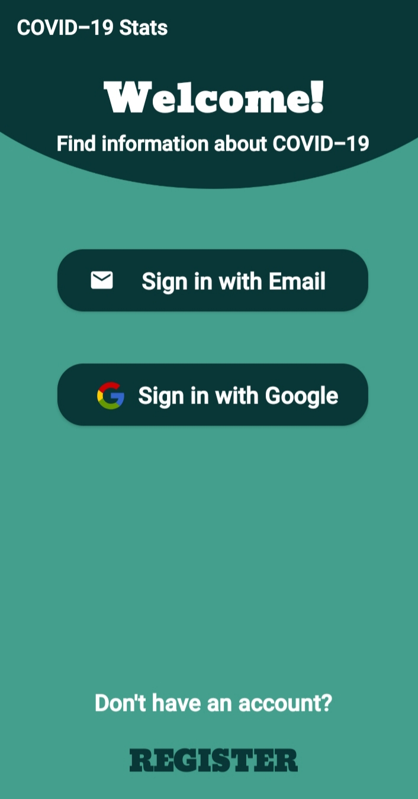
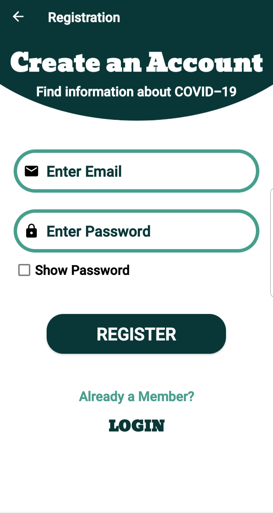
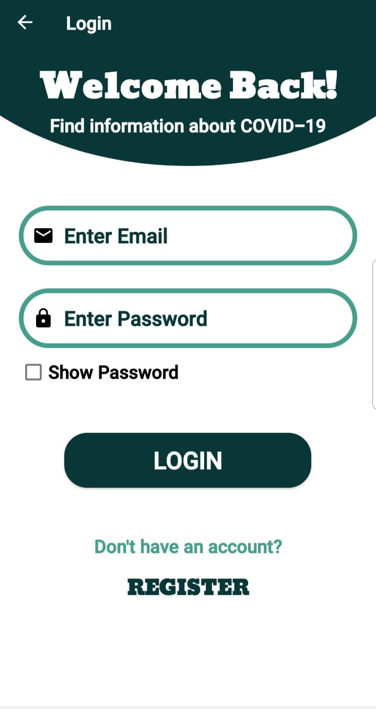
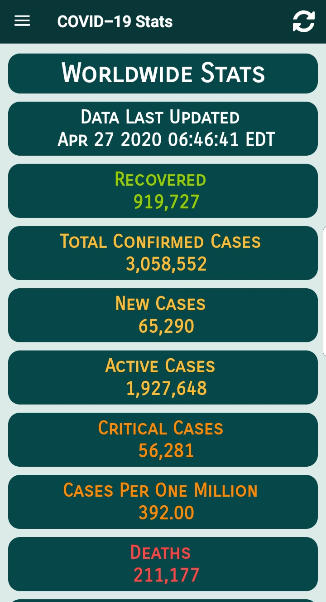
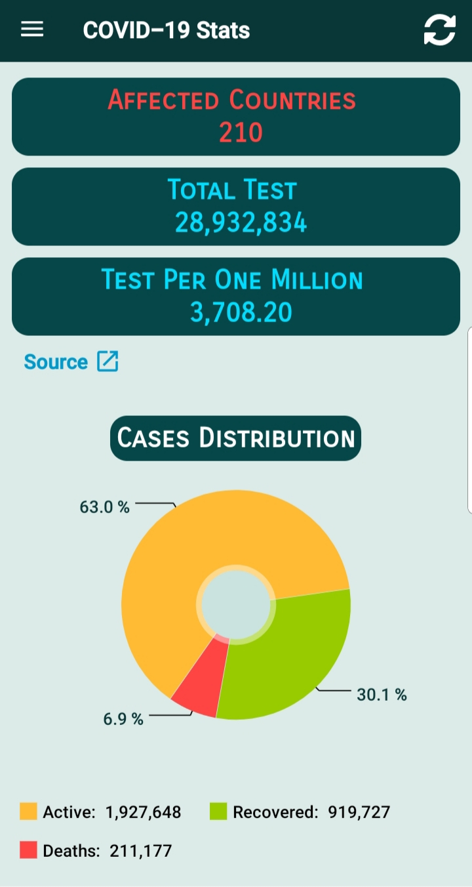
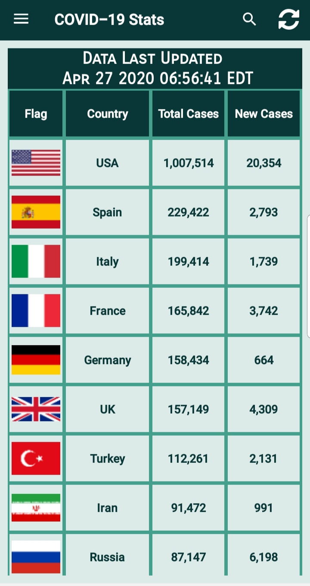
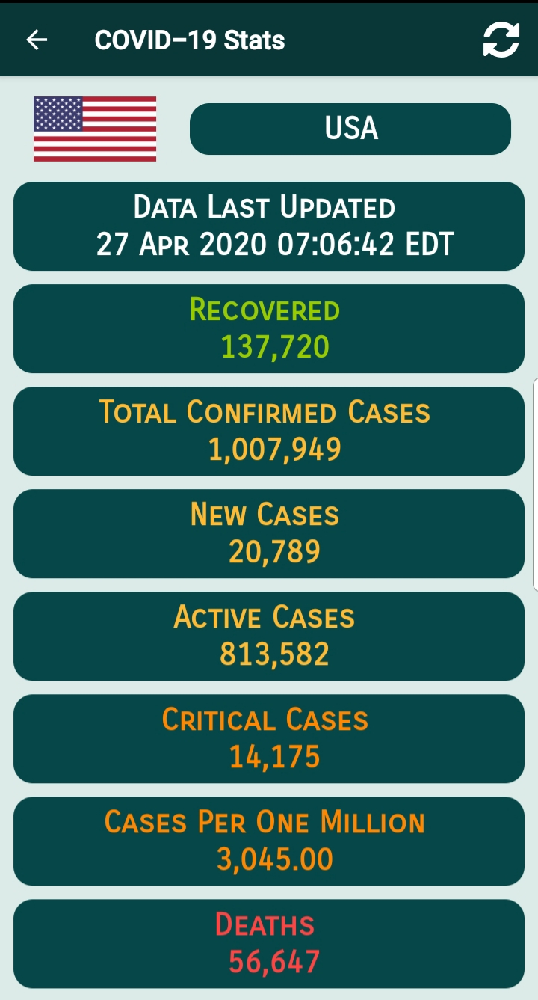
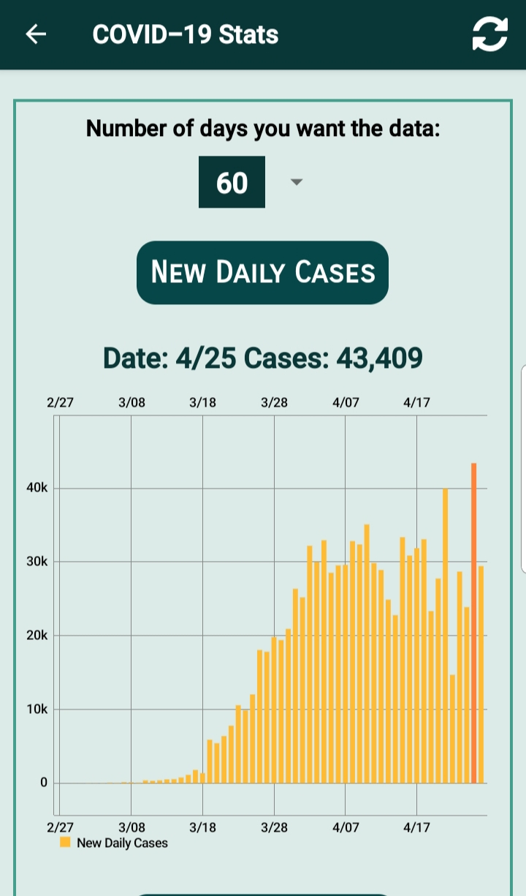
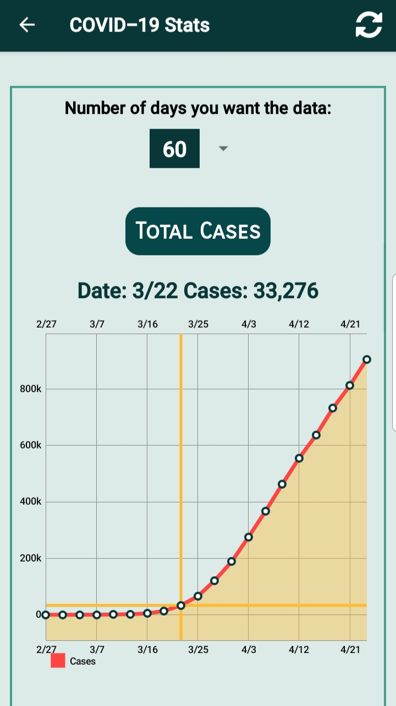
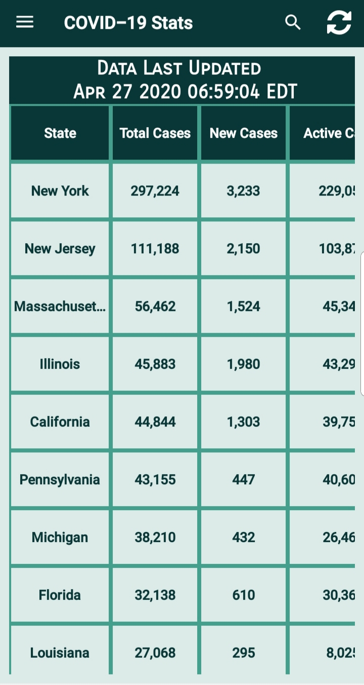

# COVID-19 Stats

> Android Application that provides quick, easy access to real-time critical data about coronavirus.

## Prerequisite 1

- The app runs off a Firebase backend. You will need to generate your firebase backend.

- Navigate to [Firebase](https://firebase.google.com/) and create a project.

- Connect your Android app to Firebase following one of the two options.

- [Add Firebase to your Android project](https://firebase.google.com/docs/android/setup#console)

- You will need to generate your own google-services.json file to use with the app.

## API Resources

- [Postman COVID-19 API Resource Center](https://covid-19-apis.postman.com/)

## Final Result

